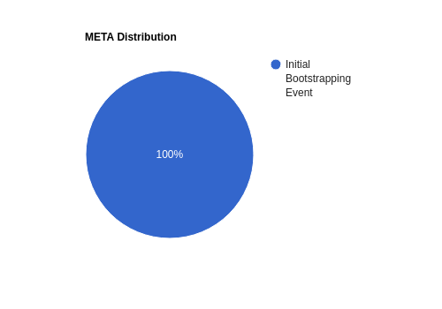

# Initial Bootstrapping Event

How the Meta-DAO will bootstrap futarchy and distribute its tokens
{: .fs-6 .fw-300 }

## Purpose

Unlike some other governance mechanisms, futarchy requires semi-liquid markets
in the native token in order to function properly. To bootstrap this, anyone
will be able to participate in the *initial bootstrapping event*, which will
distribute the Meta-DAO's tokens. In the bootstrapping event, participants will
exchange SOL for META, with their SOL going direcly to the Meta-DAO's treasury.

From there, the SOL could be used to build products under the Meta-DAO umbrella,
fund other projects in exchange for financial upside, or whatever the market decides.

## Distribution

Here's a pie chart showing how META will be distributed:

In other words, all initial META will be issued through the bootstrapping event.
The Meta-DAO would be able to mint new META for accretive activities, such as
compensating contributors, acquisitions, or token swaps with other projects.
But all of that would be done via the futarchic mechanism rather than any pre-mine.

## Mechanics

TBD, likely an uncapped fixed-price issuance or using a liquidity bootstrapping
pool

