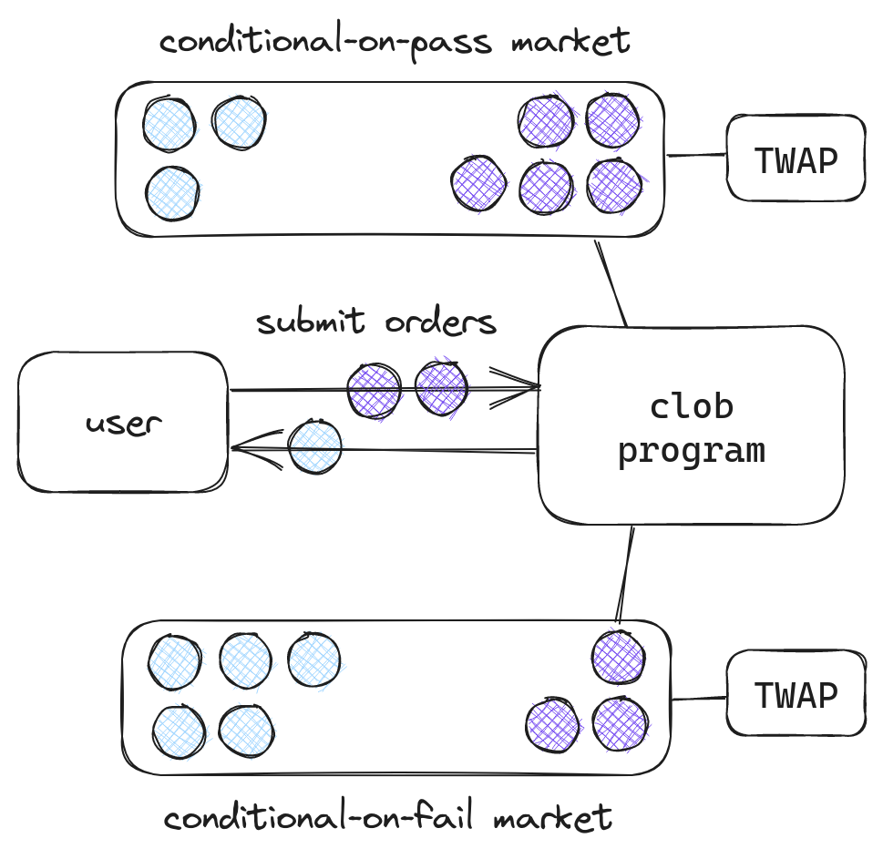
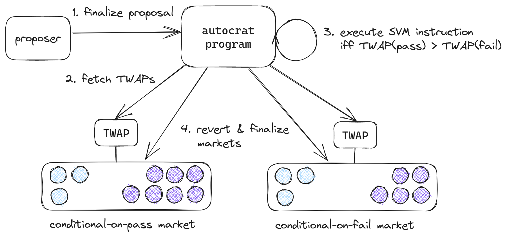

# Implementation

How the Meta-DAO implements futarchy
{: .fs-6 .fw-300 }

## Overview

The Meta-DAO is composed of 3 open-source programs on the Solana blockchain:
- a *conditional vault* program,
- a *central-limit order book (CLOB)* program,
- and *autocrat*, the program that orchestrates futarchy.[^1]

*META* is the native token.

## Conditional vault program

As described in [futarchy](./futarchy.md), futarchy requires the ability to
'revert' trades in a market so that everyone gets back their original tokens.
Unfortunately, Solana doesn't allow one to revert transactions after they've
been finalized, so we needed a mechanism to *simulate* reverting trades. That
mechanism is conditional tokens.

Before minting conditional tokens, someone needs to create a *conditional vault*.
Conditional vaults are each tied to a specific *underlying token* and *settlement
authority*. Then, anyone can deposit underlying tokens into the vault in exchange
for an equivalent number of conditional tokens.

At any time, the settlement authority can either *finalize* or *revert* a vault.

If a settlement authority finalizes a vault, current conditional token holders 
can redeem their conditional tokens in exchange for an equal number of underlying
tokens.

If a settlement authority reverts a vault, all conditional token minters can get
back what their originally deposited. This has the same effect as reverting
all of the transfers.

For every proposal, the Meta-DAO creates four vaults. It designates one of these
the conditional-on-pass META vault, one the conditional-on-fail META vault, one 
the conditional-on-pass SOL vault, and one the conditional-on-fail SOL vault.

This allows us to achieve the desired reverting of markets. If someone mints
conditional-on-pass META and trades it for conditional-on-pass SOL, either the
proposal will pass and they will receive SOL or the proposal will fail and they
will receive their original META back.

## CLOB program

Unfortunately, although a few central-limit order books (CLOBs) exist on Solana,
none of them provide on-chain TWAPs. So we [built our own](https://metaproph3t.github.io/posts/yalob.html).
It incorporates the middle-price of the order book *at the beginning of each slot*
into the TWAP, which makes manipulation hard because an attacker would have to
either control blockspace or risk losing a substantial sum. The risks of such
an attack are further weakened by [this logic](https://github.com/metaDAOproject/meta-dao/blob/e3dd1a4aa35dd3fedfa6fb38d77977dbbfb8d99e/programs/clob/src/state/order_book.rs#L109-L149), which prevents the current price observation from deviating
far from the last one.

All code is unaudited, so the CLOB also contains a series of runtime invariants,
for example checking that the total liabilities are never greater than total assets.

## Autocrat

The central program of the Meta-DAO is autocrat, specifically `autocrat_v0`.

Anyone can interact with autocrat to create a *proposal*, which is a Solana account
containing fields such as *proposal number*, *proposal description link*, and
an executable Solana Virtual Machine (SVM) instruction. An SVM instruction could
encode, for example, a transfer of 150,000 USDC to a development team to build
a new product or maintain an existing one, as is common practice in DeFi.[^2]

When the proposal is created, autocrat ensures that the requisite conditional tokens
and markets have also been created. Specifically, it validates that conditional-on-pass
META and conditional-on-pass SOL have been created and that a market exists
to trade between them (the *pass market*), and the same for conditional-on-fail META and 
conditional-on-fail SOL (the *fail market*).

At the end of a configurable number of slots (currently 10 days worth), anyone
can trigger proposal finalization. In finalization, autocrat checks if the TWAP
of the pass market is higher than the TWAP of the fail market, and if it is
executes the SVM instruction, finalizes the pass market, and reverts the fail
market. If it isn't, autocrat ignores the SVM instruction, reverts the fail market,
and finalizes the pass market.

----

[^1]: The name 'autocrat' is a double-entendre: the program is to a large extent
the dictator of the Meta-DAO, and it is also just computer code.
