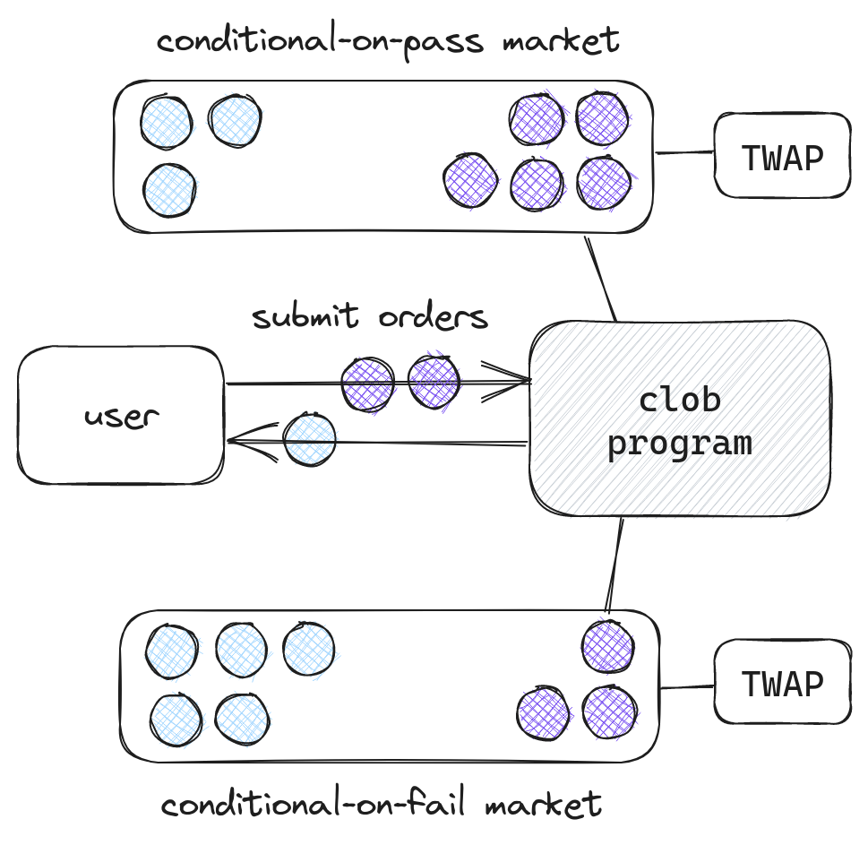
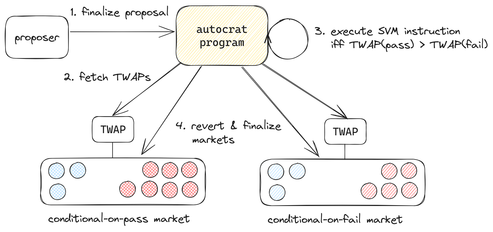

# Implementation

How the Meta-DAO implements futarchy
{: .fs-6 .fw-300 }

## Overview

The Meta-DAO is composed of 3 open-source programs on the Solana blockchain:
- a *conditional vault* program,
- a *central-limit order book (CLOB)* program,
- and *autocrat*, the program that orchestrates futarchy.[^1]

*META* is the native token.

## Conditional vault program

As described in [futarchy](https://metadaoproject.github.io/docs/mechanics/futarchy.html),
futarchy requires the ability to
'revert' trades in a market so that everyone gets back their original tokens.
Unfortunately, blockchains don't allow you to revert transactions after they've
been finalized, so we need a mechanism to *simulate* reverting transactions.
That mechanism is conditional tokens.

Before minting conditional tokens, someone needs to create a *conditional vault*.
Conditional vaults are each tied to a specific *underlying token* and *settlement
authority*. Aftera vault has been created, anyone can deposit underlying tokens
into it in exchange for an equivalent number of conditional tokens.

At any time, the settlement authority can either *finalize* or *revert* a vault.

If a settlement authority finalizes a vault, current conditional token holders 
can redeem their conditional tokens in exchange for an equal number of underlying
tokens.

If a settlement authority reverts a vault, all conditional token minters can get
back what their originally deposited. This has the same effect as reverting
all of the transfers.

For every proposal, the Meta-DAO creates four vaults. It designates one of these
the conditional-on-pass META vault, one the conditional-on-fail META vault, one 
the conditional-on-pass SOL vault, and one the conditional-on-fail SOL vault.

This allows us to achieve the desired reverting of markets. If someone mints
conditional-on-pass META and trades it for conditional-on-pass SOL, either the
proposal will pass and they will receive SOL or the proposal will fail and they
will receive their original META back.

## CLOB program

These types of trades could theoretically be performed through any central-limit
order book (CLOB) or automated market-maker (AMM). However, there existed no
CLOBs or AMMs on Solana that provided on-chain TWAPs.
So we [built one](https://metaproph3t.github.io/posts/yalob.html).[^2]

The Meta-DAO creates two order books per proposal: one for trading conditional-on-pass
META for conditional-on-pass SOL and one for trading conditional-on-fail META for
conditional-on-fail SOL. We call the former a *conditional-on-pass market* and
the latter a *conditional-on-fail market*.

## Autocrat

The last piece of the puzzle is *autocrat*, the program that orchestrates futarchy.

Anyone can interact with autocrat to create a *proposal*, which contains fields
such as a proposal number, proposal description link, and
an executable Solana Virtual Machine (SVM) instruction. For example, someone
could create a proposal to transfer 150,000 USDC to a development team to improve
a product that's managed by the Meta-DAO.[^3]

The requisite conditional vaults and markets are created at the same time.

After a configurable amount of time (currently 10 days), anyone
can trigger proposal finalization. In finalization, autocrat checks if the TWAP
of the pass market is higher than the TWAP of the fail market, and if it is
executes the SVM instruction, finalizes the pass market, and reverts the fail market.
Otherwise, it marks the proposal as failed,
finalizes the fail market, and reverts the pass market.

## Example flows

We can demonstrate how this all fits together with a few examples.

### Example #1 - A bad proposal

Governance attacks are relatively uncommon but do happen, such as the one that
afflicted Beanstalk Protocol.[^4] It's worth considering how the Meta-DAO would
respond to such an attack.

Suppose that an attacker has just submitted a proposal that transfer's all of the
Meta-DAO's assets to himself. How is the community incentivized to respond? Well,
if the proposal goes through, the Meta-DAO will be worth a lot less. For example,
if the Meta-DAO is currently worth $100M
and the proposal would transfer $40M of the Meta-DAO's liquid assets,
then it should be worth $60M if the proposal goes through.[^5] So if you hold META
and its current price is $1, you are incentivized to sell it in the conditional-on-pass
market until its market price reaches $0.6. On the other hand, the proposal failing
should not affect META's value at all, so it should trade near $1 in the conditional-on-fail
market. As such, autocrat will fail this proposal, reverting the conditional-on-pass
vaults such that those who conditionally sold can get back their META.

### Example #2 - A good proposal

Now consider what should happen when a good proposal emerges. Suppose that someone
has just made a proposal to fund a project that would improve a product that the Meta-DAO
manages. The proposal is requesting $5M paid over 2 years and analysts estimate
that the improvements would add $25M to the Meta-DAO's [enterprise value](https://en.wikipedia.org/wiki/Enterprise_value),
so the proposal would on net create $20M of value.

[Economically rational](https://www.britannica.com/money/topic/economic-rationality)
participants would then be incentivized to bid up META in the conditional-on-pass
markets until its price reaches $1.2. If the price dips lower, say to $1.1, this
represents a bargain opportunity: participants can buy $1.2 of [net present value](https://en.wikipedia.org/wiki/Net_present_value)
for only $1.1! Traders would be likely to take this trade until the price reached
a level near $1.2 again. But again, the proposal would have no impact on the Meta-DAO
if it were to fail, so we would expect META to trade near $1 in the conditional-on-fail
markets. So autocrat would pass this proposal.

----

[^1]: The name 'autocrat' is a double-entendre: the program is to a large extent the dictator of the Meta-DAO, and it is also just computer code.
[^2]: This CLOB incorporates the middle-price of the order book *at the beginning of each slot* into the TWAP, which makes manipulation hard because an attacker would have to either control blockspace or risk losing a substantial sum. The risks of such an attack are further weakened by [this logic](https://github.com/metaDAOproject/meta-dao/blob/e3dd1a4aa35dd3fedfa6fb38d77977dbbfb8d99e/programs/clob/src/state/order_book.rs#L109-L149), which prevents the current price observation from deviating very far from the last one.
[^3]: For an example of a proposal like this, see [this Lido one](https://snapshot.org/#/lido-snapshot.eth/proposal/0x37c958cfa873f6b2859b280bc4165fbdf15b1141b62844712af3338d5893c6c8).
[^4]: https://medium.com/immunefi/hack-analysis-beanstalk-governance-attack-april-2022-f42788fc821e
[^5]: In this analysis, we ignore the effect that such a proposal going through would have on the Meta-DAO's remaining assets. In practice, a successful governance attack would likely erode confidence such that the real losses from a $40M governance attack would be much larger than $40M.
